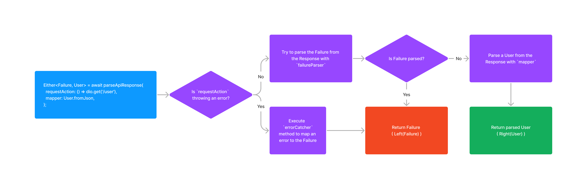

Response Parser makes it easier to parse data and error responses from the server.

<a href="https://opensource.org/licenses/MIT"></a>
<a href="https://pub.dev/packages/response_parser"></a>
<a href="https://codecov.io/gh/Maksimka101/response_parser">
  
</a>

## Getting started

Do you want to write pretty functions like this...
```dart
Future<Either<ApiFailure, User>> fetchUser() async {
  return parseApiResponse(
    requestAction: () => dio.get('/user'),
    mapper: User.fromJson,
  );
}
```

<details>
  <summary>...instead of this boring code?</summary>

```dart
Future<Either<ApiFailure, User>> fetchUser() async {
  final dio = Dio(BaseOptions(baseUrl: 'https://example.com'));
  try {
    final request = await dio.get('/user');
    final data = request.data?['data'];
    if (data == null) {
      final error = request.data?['error'];
      if (error != null) {
        return left(ApiFailure.serverFailure(error['message']));
      } else {
        return left(ApiFailure.unknown());
      }
    } else {
      return right(User.fromJson(data));
    }
  } catch (error, st) {
    ApiFailure? apiFailure;
    if (error is DioError) {
      final responseFailure = error.response?.data;
      if (responseFailure is Map<String, dynamic>) {
        apiFailure = ApiFailure.serverFailure(responseFailure['message']);
      } else {
        apiFailure = ApiFailure.httpError(error.response?.statusCode);
      }
    }
    return left(apiFailure ?? ApiFailure.unknown());
  }
}
```
</details>

Then continue reading!

<details>
  <summary>Don't know what is `Either`?</summary>

  It's a type from [`fpdart` package](https://pub.dev/packages/fpdart).
  It's used to return either error (left) or data (right).
</details>

## Usage

To do so, you need to do a little preparation.\
For example, let's assume your server returns such response:
```jsonc
{
  "data": {
    // Data you requested
  },
  "error": {
    // Server error which you should parse and show to user
    "message": "Something went wrong"
  }
}
```
And your error model looks this way:
```dart
class ApiFailure {
  factory ApiFailure.unknown() = _UnknownApiFailure;
  factory ApiFailure.serverFailure(String errorMessage) = _ServerFailure;
  factory ApiFailure.httpError(int? statusCode) = _HttpError;
}
```
Then you need to implement `dataExtractor`, `failureParser` and `errorCatcher` this way:
```dart
final _exampleResponseParser = ResponseParser<Response, ApiFailure>(
  dataExtractor: (response) => response.data['data']!,
  failureParser: (response) {
    final error = json['error'];
    if (error is Map<String, dynamic>) {
      return ApiFailure.serverFailure(error['message']);
    } else {
      return null;
    }
  },
  errorCatcher: (error, stackTrace) {
    ApiFailure? apiFailure;
    if (error is DioError) {
      apiFailure = ApiFailure.httpError(error.response?.statusCode);
    }
    return apiFailure ?? ApiFailure.unknown();
  },
);
```
And create top level `parseApiResponse`, `parseListApiResponse` and `parseEmptyApiResponse` functions.
```dart
final parseApiResponse = _exampleResponseParser.parseApiResponse;
final parseListApiResponse = _exampleResponseParser.parseListApiResponse;
final parseEmptyApiResponse = _exampleResponseParser.parseEmptyApiResponse;
```

## How it works

This diagram shows how `parseApiResponse` works under the hood:



Actually, everything in the `parseApiResponse` method is wrapped with the `try-catch` block.
So this method is safe and can't throw any exceptions.

## Another way to use

Instead of creating top-level functions, you can create a class
which extends `ResponseParserBase` and overrides it's methods:
```dart
class DefaultResponseParser extends ResponseParser<Response, ApiFailure>{
  Object extractData(Response response) => response.data['data']!;

  Failure? parseFailure(Response response) {
    final error = json['error'];
    if (error is Map<String, dynamic>) {
      return ApiFailure.serverFailure(error['message']);
    } else {
      return null;
    }
  };

  Failure catchError(Object error, StackTrace stackTrace) {
    ApiFailure? apiFailure;
    if (error is DioError) {
      apiFailure = ApiFailure.httpError(error.response?.statusCode);
    }

    return apiFailure ?? ApiFailure.unknown();
  };
}
```

---

That's all!\
For more info, you can take a look at the example.
